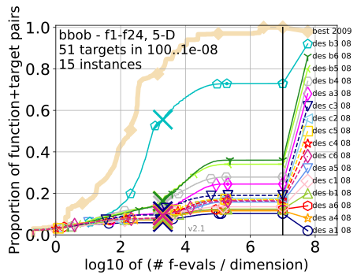
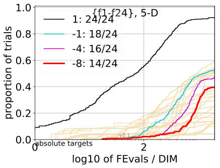
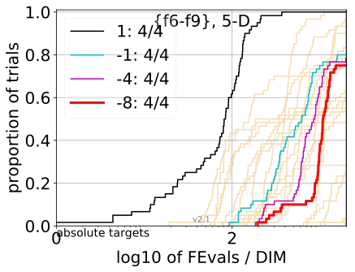
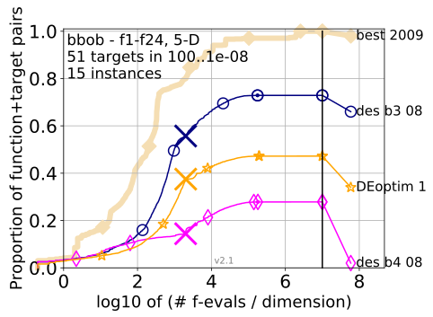

```{r setup, include=FALSE}
knitr::opts_chunk$set(echo = TRUE)
knitr::opts_chunk$set(out.width="100px", dpi=120)
```

## Algorithm implementation
We have fulfilled our assignment by implementing a modified Differential Evolution algorithm. One of our tasks was to prepare the code in the form of library so we have prepared it as an R package containing our implementation. As described in preliminary documentation we have used COCO BBOB 2015 benchmarking framework to test the implemented algorithm.

## Experiments
In order to test our algorithm we have planned to run BBOB multiple times for different parameters configuration. We have managed to test the most notable parameters which we decided are:

* $\lambda$ - population size
* $\mu$ - offspring number
* $H$ - time horizon of archive


Rest of the parameters where set to defult values as presented in the original paper.

We decided to test each value of $\mu$ and $H$ with each value of $\lambda$.

Additionally we have performed benchmarking of Differential Evolution algorithm from __DEoptim__ R package to compare our implementation of DES modification with standard form of DE.

### Parameters and labeling
We have tested 16 different configurations of tunable parameters. To keep track of them we have labeled each $\lambda$ value with one of the letters $a,b,c$ and each $\mu$ or $H$ modification with digit from $1$ to $6$. Legend of the parameters and values we used is shown below:

| Parameter      | |||
| -------------- | ------------------ |-|-|
| $\lambda$ | $a=2n$  |  $b=4n$ | $c=4\sqrt{n}$  |
| $\mu$ | $1=\lambda$ | $2=\frac{\lambda}{4}$ |$3=\frac{\lambda}{2}$ |
|$H$|$4=6+3\sqrt{n}$|$5=6+6\sqrt{n}$|$6=6+3n$|

All combinations of letters and numbers where used for testing, which results in 16 unique configurations. 

### BBOB 2015 benchmark setup
 We used standard benchmark functions set consisting of 24 noise-less functions $f_i: R^n \rightarrow R, i=1,2,...,24$ with 15 instances each. Those function instances were optimized for dimensions $n=2,3,5,10,20,40$. We set budget for experiments to $10000$, maximum function evaluations per problem was equal to $MaxFEvals=BUDGET*n$ which may be not identical to evaluations per algorithm run because R language interface for BBOB implemented mechanism of independent restarts.

## Benchmark results


As we can see in the summary above most of the parameter configurations gave similar results except configuration $b3$ which stands for $\lambda=4n,\ \mu=\frac{\lambda}{2}$. It has doubled the offspring number in comparison with the default configuration, which is $b4$ and has the pamameters of $\lambda=4n,\mu=\frac{\lambda}{2}$ and $H=6+3\sqrt{n}$. Slightly better results were also observed with configurations labeled: $b6(\lambda=4n,H=6+3n)$ and $b5(\lambda=4n,H=6+6\sqrt{n})$. Both of which had larger time horizon than our reference parameters set. It seems the the population size of $4n$ is a rather good choice as configurations with this parameter were almost always on top, with one exception being $b1$ which performbed badly most likley due the the very small number of offspring choosen in the selection phase of the algorithm. 

### Best configuration results
|||
|-|-|
||  |
|XXX|xxx|

The top left plot shows how many targets were reached for all 24 functions.The top right plot shows us that DES performed well for ill conditioned functions and managed to reach all targets.


### DEoptim comparison



## Conclusions

The DES algorithm was sucessfully implemented, various parameters were tested using the BBOB optimization framework benchmark, and lastly the implementation was packaged into an R library for ease of use. As we can see from the benchmark results the DES algoritm prormed best for the parameter set of $\lambda=4n,\mu=\frac{\lambda}{4}$ and $H=6+3\sqrt{n}(b3)$. We can also identify that the DES worked best for ill conditioned functions as it managed to read all targets, and worst for multi-modal functions.
